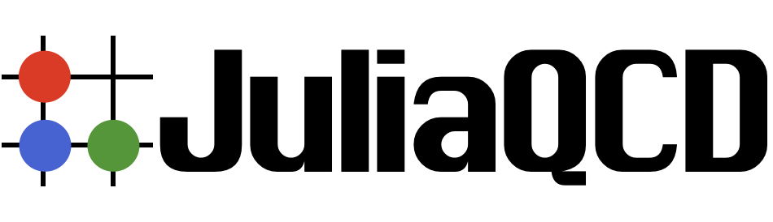
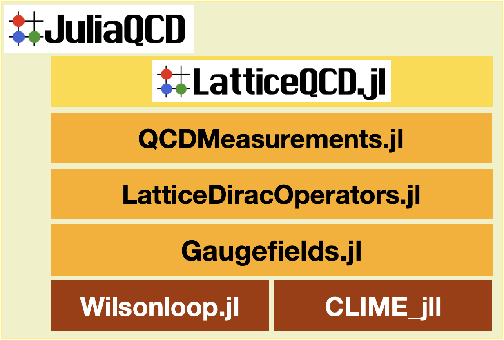

<figure>
  
</figure>

JuliaQCD is a native Julia code for lattice QCD, which enabales you to perform lattice QCD calculations!

This package is organized as follows. Basically, upper side depends on lower packages.

<figure>
  
  <figcaption>Relation between pojects</figcaption>
</figure>

- [LatticeQCD.jl](https://github.com/akio-tomiya/LatticeQCD.jl) : Wrapper of following packages. You can start lattice calucations with standard setups with user friendly parameter wizard. If you want to perform simulations in an expert way, please use following packages.
- [QCDMeasurements.jl](https://github.com/akio-tomiya/QCDMeasurements.jl) : QCDMeasurements.jl is a package for measuring physical quantities. This has measurements for basic quantities like chiral condensates, plaquettes. Moreover, pion correlators and topological charge with several definitions. This also has the gradient flow with several actions.
- [LatticeDiracOperators.jl](https://github.com/akio-tomiya/LatticeDiracOperators.jl) : LatticeDiracOperators.jl is a package for Dirac operators and fermions on the lattice. Treating pseudo-femrion fields with various lattice Dirac operators, fermion actions with MPI. This can generate configurations with dynamical fermions.
- [Gaugefields.jl](https://github.com/akio-tomiya/Gaugefields.jl) : Gaugefields.jl is a package for lattice lattice SU(N) gauge fileds. Treating gauge fields (links), gauge actions with MPI and autograd. This can generate quenched configurations.  
- [Wilsonloop.jl](https://github.com/akio-tomiya/Wilsonloop.jl) : Wilsonloop.jl helps us to treat with the Wilson loops and generic Wilson lines in any Nc and dimensions. Wilson lines can be defined in symbolly.

# Q&A/Issues
Please post your questions/issues in [here](https://github.com/orgs/JuliaQCD/discussions).

# Acknowledgment
If you write a paper using this package, please refer this code.

BibTeX citation is following
```
@article{Nagai:2024yaf,
    author = "Nagai, Yuki and Tomiya, Akio",
    title = "{JuliaQCD: Portable lattice QCD package in Julia language}",
    eprint = "2409.03030",
    archivePrefix = "arXiv",
    primaryClass = "hep-lat",
    month = "9",
    year = "2024"
}
```
and the paper is [arXiv:2409.03030](https://arxiv.org/abs/2409.03030).
